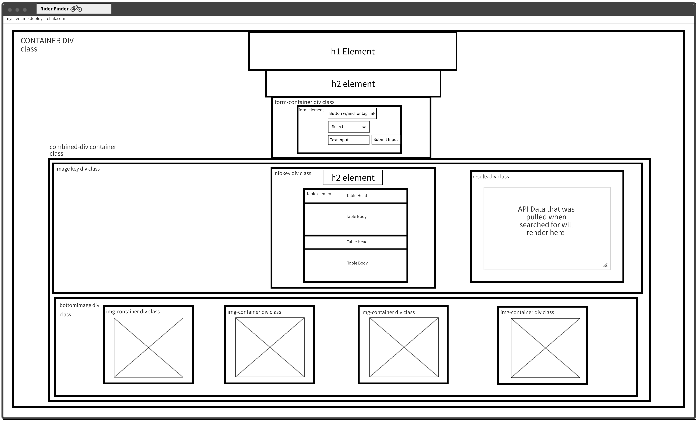

# **Rider Finder - Project 1**
By Isaac Asher

</br>

### **Project Description**

---

Ride Worldwide is made for Bike-Riders All over the world. It allows users to input their location & find the nearest public city bikes that they can use. Through the use of a form, Users can select between 2 choices of Country or City/State. Enter the name in a text box below that selection, and then search for the nearest public city bikes available for use by pulling the API Data from the Public CityBikes API Documentation and rendering it to the screen once the form is submitted.

</br>

### **Technologies Used**

---

- HTML
- CSS
- JavaScript
- jQuery
- ajax
- CityBikes API

</br>

### **API Description**

---
- Sports & Fitness API that provides a network of public city bikes around the globe with individual descriptions for each object inclduing: (name, id, loocation, company, etc..)

- CityBikes API Documentation: https://api.citybik.es/v2/

</br>

## **Testing the API Using ajax in Javascript**

---

```js

$.ajax("http://api.citybik.es/v2/networks")
.then((data) => {
    console.log(data)
    console.log(data.networks)
    console.log(data.networks[106])
    console.log(data.networks[106].name)
    console.log(data.networks[106].location.city)

})

```

</br>

### **Wireframe Mockup**

---

##### *Link To view:* https://wireframepro.mockflow.com/view/MkncvE3wlpb

</br>



</br>

### **Details about Difficulties**

---

Lorem Ipsum is simply dummy text of the printing and typesetting industry. Lorem Ipsum has been the industry's standard dummy text ever since the 1500s, when an unknown printer took a galley of type and scrambled it to make a type specimen book. It has survived not only five centuries, but also the leap into electronic typesetting, remaining essentially unchanged. It was popularised in the 1960s with the release of Letraset sheets containing Lorem Ipsum passages, and more recently with desktop publishing software like Aldus PageMaker including versions of Lorem Ipsum.

</br>

### **Daily Schedule**

---

| Day | Task |   
|-----|------|
| 1 | Setup Basic Project + Pick API & Test it | 
| 2 | Set up HTML and minimal css |
| 3 | Make API Calls |   
| 4 | Render Data to the page |     
| 5 | Final styling Touch ups | 


